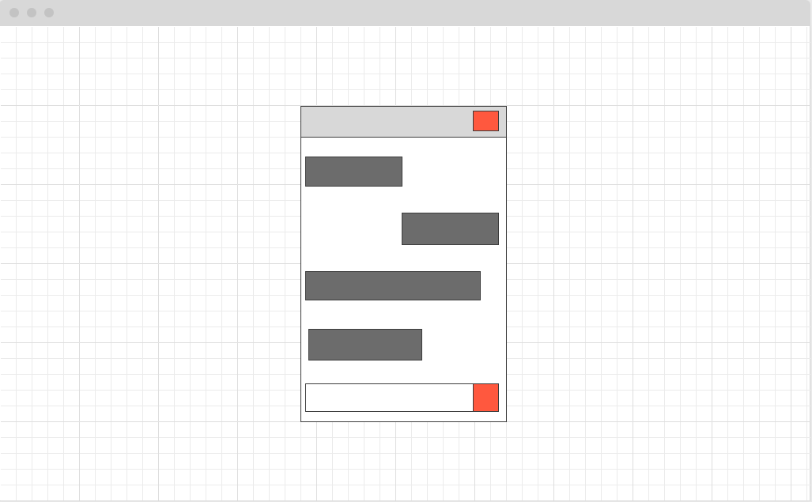

# MyChat

## Description
- Chat app for mobile. 

## User Experience
- As a user, I want to be able to create a profile
- As a user, I want to be able to send a message
- As a user, I want to be able to reply to a to a message
- As a user, I want to be able delete messages

## Wireframes

## Tech Stack
- React Native
- Bootstrap

## MVP
- Users will be able to:
    - [ ] Login/Signup 
    - [ ] Have a profile page 
    - [ ] Send message 
    - [ ] Delete message

## Stretch Goals
- User will be able to:
  - [ ] Create group chats
    - [ ] delete group chat
    - [ ] edit group chat
  - [ ] Create contacts
    - [ ] delete a contact
    - [ ] add a contact
  - [ ] Add an image to their profile

## Known Bugs
- 

## Road blocks
- 

